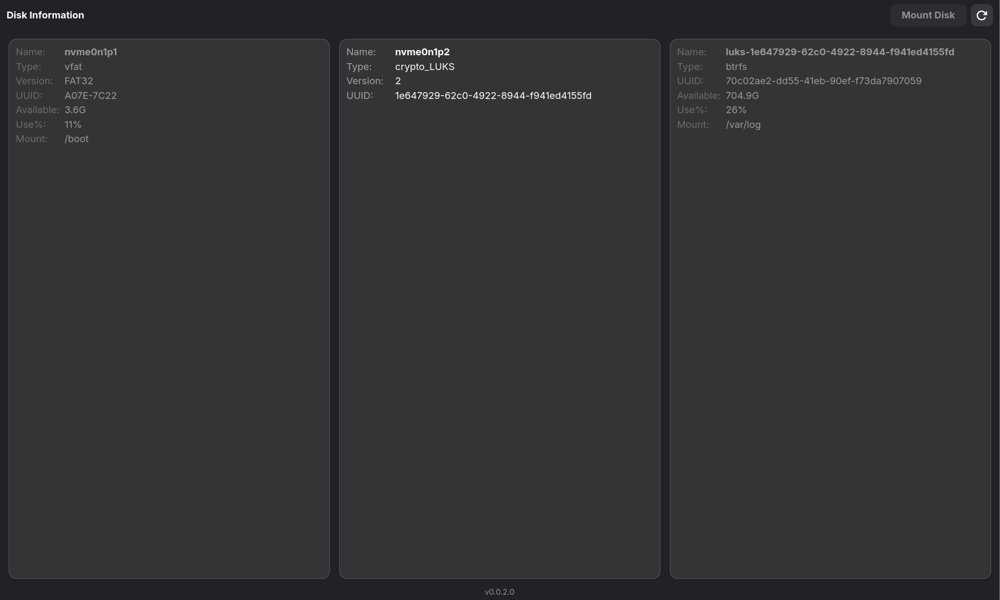
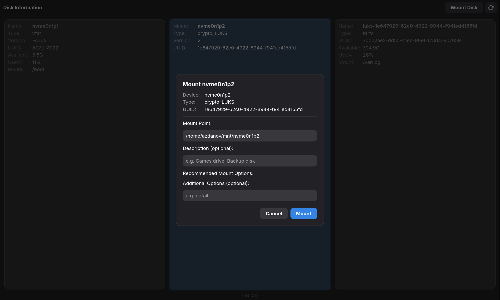

This guide covers normal day-to-day use of Pori.

## Before You Start

| Requirement               | How to Verify                     | What to Look For                                                                    |
| ------------------------- | --------------------------------- | ----------------------------------------------------------------------------------- |
| Sudo access               | `groups` command                  | Your username appears in `sudo` or `wheel` group                                    |
| Disk healthy state        | `sudo fsck -n /dev/sdXn`          | No "dirty bit" or error messages (run on unmounted disk)                            |
| Disk visible to system    | `lsblk -f`                        | Your device appears in the list with filesystem type (ext4, ntfs, etc.)             |
| Mount point parent exists | `ls -la /mnt` or your chosen path | Parent directory exists (Pori creates the final mount point, but not the full path) |

## Mount a Disk

:::caution[Data Safety]

- **Double-check the device**: Pori shows disk sizes and labels, but verify you're selecting the correct physical disk.
- **Avoid system directories**: Never mount to `/home`, `/usr`, `/var`, or other system paths unless you know exactly what you're doing.
- **Unmount before unplugging**: Always use Pori's unmount (or `systemctl stop`) before physically disconnecting USB drives to prevent corruption.

:::

1. Open Pori.
2. Select a drive that is not already mounted.
3. Click **Mount Disk**.
4. In the dialog:
   - Confirm or edit the mount point.
   - (Optional) add a description.
   - Keep or adjust recommended mount options.
   - (Optional) add extra comma-separated options.
5. Click **Mount**.
6. Authenticate when prompted.

If successful, Pori refreshes the device list and the disk appears as mounted.

## Mount Options

Pori pre-selects recommended options based on filesystem type:

| Filesystem | Default Options              | Notes                                                                   |
| ---------- | ---------------------------- | ----------------------------------------------------------------------- |
| `ext4`     | `defaults`                   | Standard POSIX permissions                                              |
| `ntfs`     | `defaults,uid=1000,gid=1000` | Placeholders resolved to your actual UID/GID at mount time              |
| `exfat`    | `defaults,uid=1000,gid=1000` | Same UID/GID resolution                                                 |
| `udf`      | `defaults,uid=1000,gid=1000` | For if you want to game from the same partition on both linux & windows |

### Extra Options

Add comma-separated options (e.g., `noexec,nosuid,ro` for read-only, no-execution access). These append to the recommended set.

## NTFS Confirmation

When mounting an NTFS disk, Pori shows a compatibility warning before continuing. You can cancel or proceed.

## What Pori Creates

For a mount point like `/home/alice/mnt/games`, Pori creates:

- Unit file: `/etc/systemd/system/home-alice-mnt-games.mount`
- Unit content mapping:
  - `What=/dev/disk/by-uuid/<UUID>`
  - `Where=<mount point you chose>`
  - `Type=<filesystem type>`
  - `Options=<selected options>`

Pori then runs:

- `systemctl daemon-reload`
- `systemctl enable --now <unit>`

:::note[What Pori Doesn't Modify]

Pori creates native systemd `.mount` units. It does **not**:

- Edit `/etc/fstab`
- Create `/etc/crypttab` entries (for encrypted disks — decrypt first with your distro's disk utility)
- Handle network mounts (NFS, SMB, SSHFS)
- Manage LVM or RAID (use on activated logical volumes only)

:::

## Best Practices

- **Use descriptive mount points**: _/mnt/backup-drive_ is better than _/mnt/sdb1_ (which changes between boots).
- **Use _/mnt_ or _/media_**: which are often used for mounting. You can also create a new directory like _/drives_, _/games_, etc. Don't do home directory mounts (_/home/$USER/mnt_) if multiple users need access.
- **Label your disks**: Use _e2label_ or _ntfslabel_ so Pori shows friendly names, not just _/dev/sdb1_.
- **Check UUID stability**: Pori uses _/dev/disk/by-uuid/_ which survives disk reordering. USB drives should keep consistent UUIDs.

## Verify or Troubleshoot

- Check unit status:
  - `systemctl status <unit>.mount`
- Check logs:
  - `journalctl -u <unit>.mount`
- If authentication fails:
  - Retry with the correct sudo password.
- If a disk is missing:
  - Confirm it appears in `lsblk -f`.
