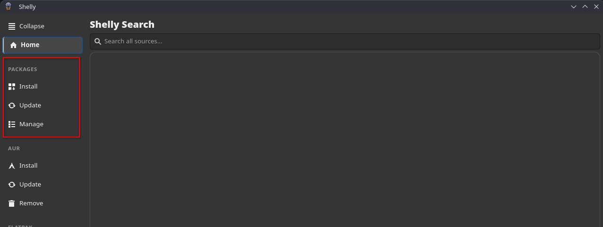
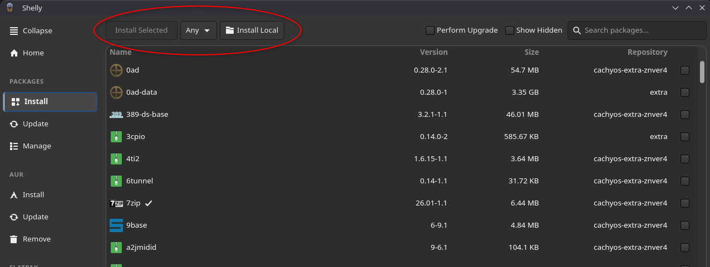
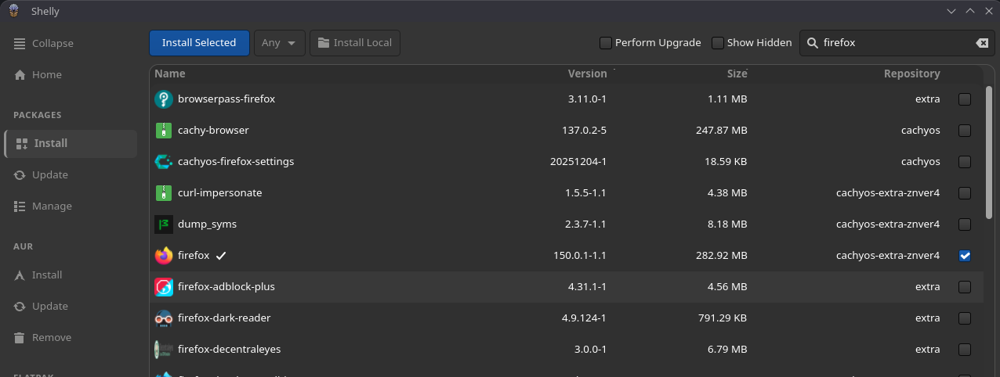
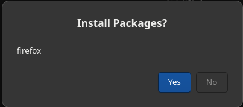
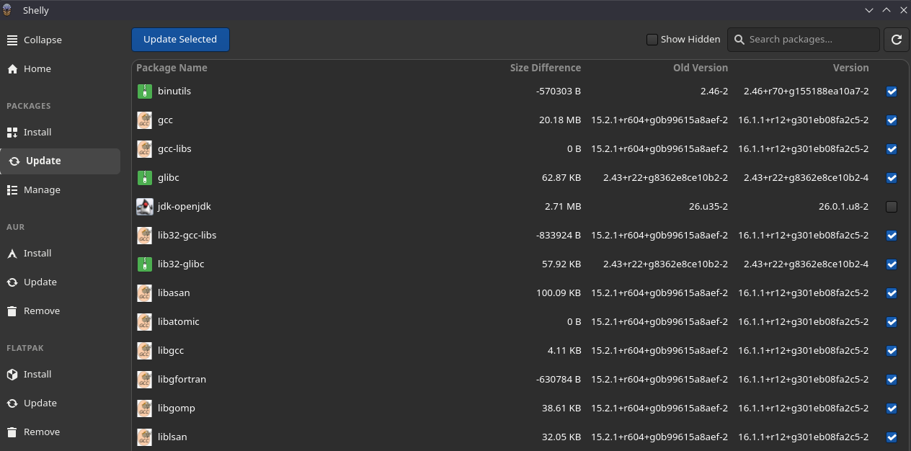
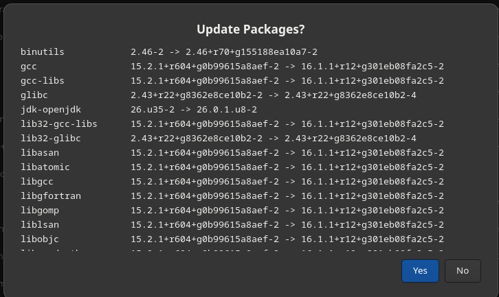

## Packages

On the left side of the screen there is the word packages, underneath are the three options for Packages.

- Install - Search and install packages, select which packages to install by selecting the checkbox on the right side and select install selected in top left to install.
  - Next to install selected there are several unique options to packages
    - Any - Listing all groups created in the repository you are using, you can select these groups to get more targeted packages
    - Install Local - Select a file on your computer and install it, will create sim links/opt allowing you to access the files via your terminal while not putting them in the bin.

- Update Packages - List of all packages with updates available, screen starts with all selected, you can
  uncheck packages to not include in update, when satisfied select update selected in top left to update all selected packages.
- Manage Packages - List of all current installed packages, their size and version. Any packages you select the check box on can be uninstalled by clicking the Remove Selected in the top left.

## Step By Step Guides

### Installation

We will walkthrough installing firefox as an example of doing an installation

- Click Install on the left side to open the list of packages for install
- Now you can either scroll down to find the package or use the search in the top right to find firefox
  
- Once you find what you want to install select the box on the right (in the picture above you will see firefox selected)
- Once you have one package selected the install selected at the top left with light up blue and you can click to install.
  - you can also at this point select any other packages you want to install them as well.
- Once you click the button an Install Packages Prompt will pop up
  
- Once you click yes you will prompted to enter your password and Shelly will execute the installation.

### Update

- Click Update underneath install in packages
- All packages will start selected, you can unclick any you want to remove them from your update.
  
  (in the above example I removed selection of one package to do partial update, I would not recommend this but you can do partial updates)
- Then click the above update selected button this will trigger a prompt to update
  
- Click yes and it will prompt a password entry and launch.
- At the end of the update shelly may prompt you to restart your computer

### Manage

**TBD**
