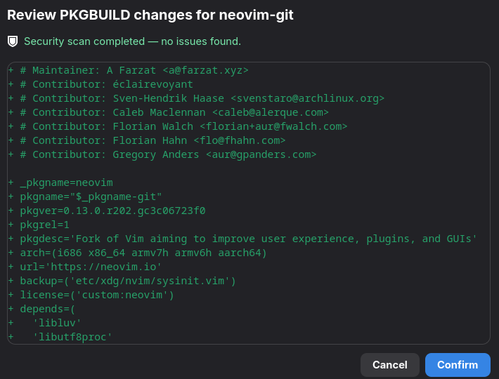

Shelly includes built-in PKGBUILD security checks for AUR installs and updates. Before you confirm a package, Shelly can review the resolved PKGBUILD data and flag patterns that deserve a closer look.

## What Shelly checks

Shelly currently focuses on two high-risk areas:

1. Post-install scriptlets that fetch or execute code outside libalpm's control.
2. Spoofed package names, dependencies, URLs, and other attacker-controlled text that use Unicode homograph tricks.

## Risky post-install behavior

Shelly inspects resolved `post_install` scriptlets for tools that commonly download or run external code during installation, including `npm`, `npx`, `yarn`, `pnpm`, `bun`, `pip`, `curl`, and `wget`.

It also flags dynamic command construction that cannot be safely reviewed ahead of time, such as:

- Command substitution with `$(...)` or backticks
- `eval`
- Bash indirect expansion with `${!var}`
- Decode-into-shell pipelines such as `base64 -d | sh`

Shelly also performs lightweight de-obfuscation before matching commands. That means tricks like `b''u''n`, `cur\l`, or `n"p"m` are still detected. If a risky tool name was deliberately hidden this way, Shelly escalates the finding to `Critical`.

:::note
These checks are intentionally conservative. A warning does not automatically mean a package is malicious, but it does mean the install path includes behavior outside normal package management.
:::

## Homograph and Unicode spoofing

Shelly also looks for text designed to look trustworthy while using different Unicode characters underneath. This helps catch package or source data that visually resembles a known project but is not actually the same string.

https://en.wikipedia.org/wiki/IDN_homograph_attack

Examples of suspicious patterns include:

- Zero-width, bidi, or other hidden control characters
- Mixed-script names, such as Latin letters mixed with Cyrillic or Greek
- Fullwidth or compatibility characters that collapse to ASCII
- Confusable Unicode characters whose skeleton maps to ASCII look-alikes

For example, a package name that visually resembles `аpаche` but uses a Cyrillic `а` can be flagged before install.

## How results are shown

When Shelly finds an issue, the result is surfaced through the PKGBUILD review flow before installation continues. In the UI app, the review dialog shows a security scan status banner alongside the PKGBUILD diff and lists each finding with its severity, hook, and matched line.

If no issues are found, Shelly reports that the security scan completed cleanly. If warnings or critical findings are present, you can review them and decide whether to continue or cancel.
