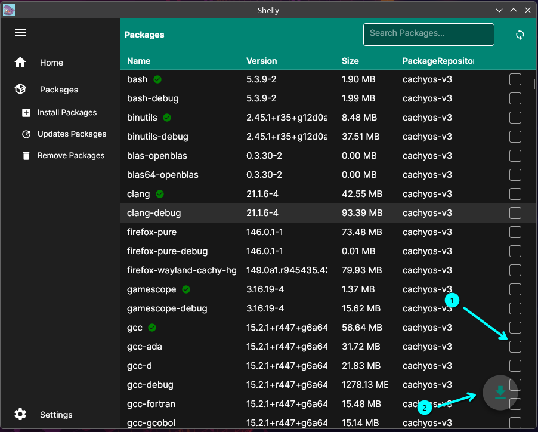
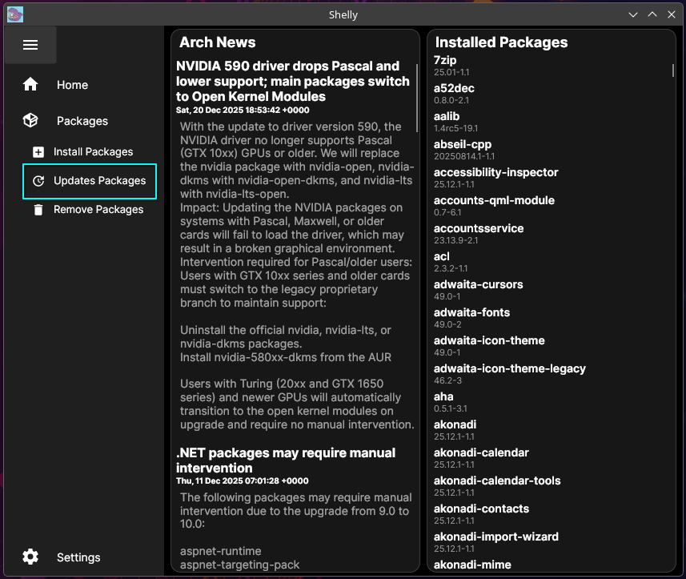
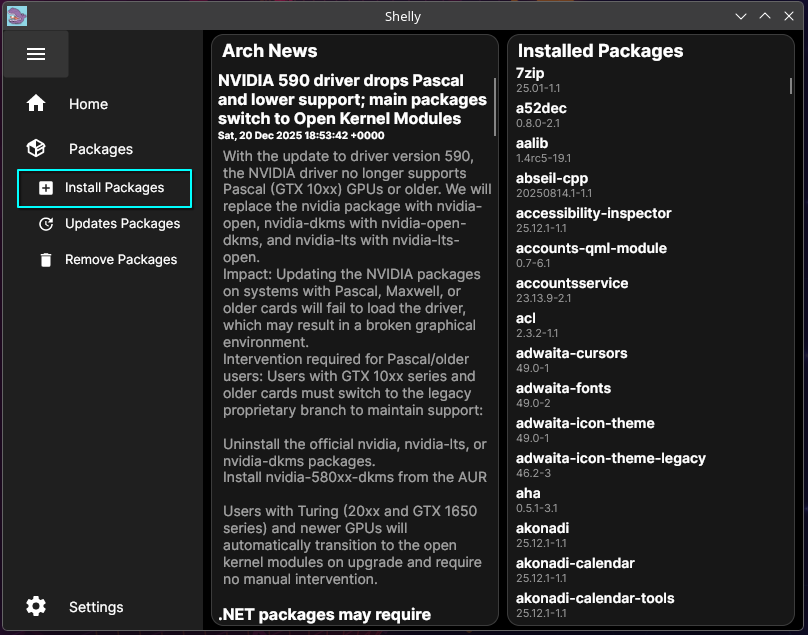
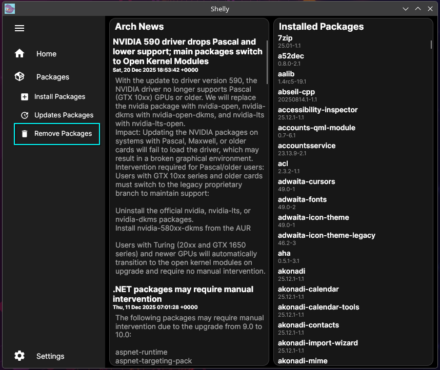

### Main Interface

The clean and intuitive package browser.

### System Updates

Easily manage and apply system updates.

### Package Search

Fast and responsive search across all repositories.

### Removing Packages

Cleanly uninstall software from your system.

