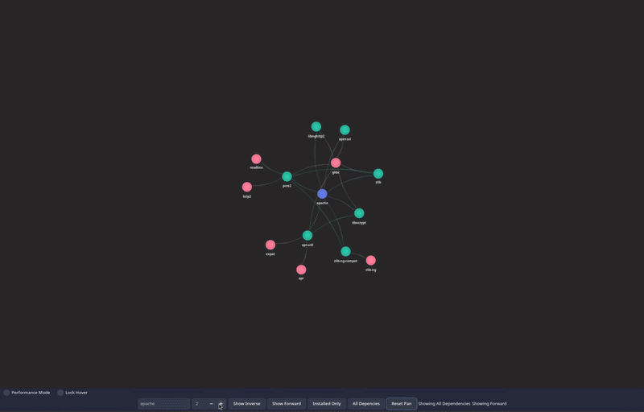

**Starfish** is a dependency viewer for Arch packages.

It is designed to help users inspect and better understand package relationships in the Arch Linux ecosystem, making it easier to explore dependency trees and package connections visually and efficiently.

## Features

- View dependency relationships for Arch packages
- Explore package connections more clearly than raw terminal output
- Built primarily with **C#**
- Includes supporting shell and styling assets

## Learn More

Visit the repository for source code, updates, and contribution information:

[View Starfish on GitHub](https://github.com/Seafoam-Labs/Starfish)
